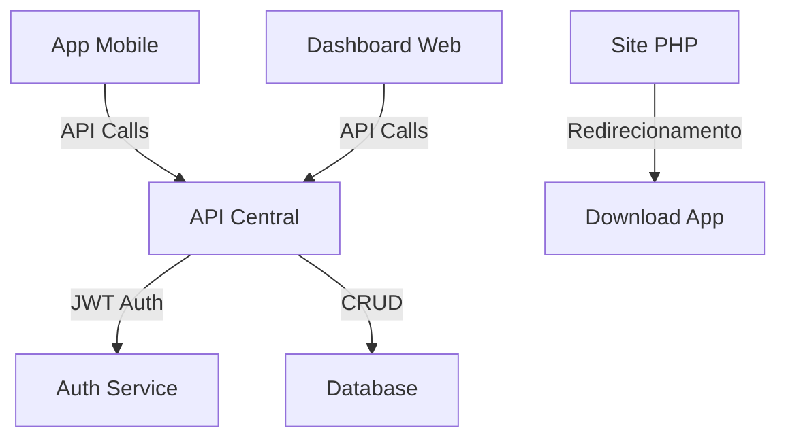

# Arquitetura do Sistema GYMFORGE

## 1. Visão Geral

O GYMFORGE é uma plataforma completa de fitness que consiste em três componentes principais:
- Aplicativo Mobile (React Native)
- Dashboard Web (React)
- Site Institucional (PHP/MySQL)

### 1.1 Diagrama de Arquitetura


## 2. Componentes do Sistema

### 2.1 API Central (Backend)
- **Tecnologias**:
  - Node.js/Express ou NestJS
  - PostgreSQL/MongoDB
  - JWT Authentication
  - TypeScript

- **Estrutura**:
```
api/
├── src/
│   ├── auth/          # Autenticação e autorização
│   ├── users/         # Gestão de usuários
│   ├── workouts/      # Gestão de treinos
│   ├── exercises/     # Biblioteca de exercícios
│   ├── metrics/       # Métricas e analytics
│   ├── gamification/  # Sistema de medalhas/níveis
│   └── config/        # Configurações
└── package.json
```

### 2.2 Aplicativo Mobile
- **Tecnologias**:
  - React Native
  - Redux/Context API
  - AsyncStorage
  - React Navigation

- **Funcionalidades**:
  - Login/Cadastro
  - Treinos personalizados
  - Biblioteca de exercícios
  - Tracking de progresso
  - Gamificação
  - Modo offline
  - Notificações push

### 2.3 Dashboard Web
- **Tecnologias**:
  - React
  - TypeScript
  - Material UI/Tailwind
  - Redux/Context API

- **Funcionalidades**:
  - Gestão de treinos
  - Métricas avançadas
  - Relatórios
  - Configurações
  - Suporte

### 2.4 Site Institucional
- **Tecnologias**:
  - PHP
  - MySQL
  - Bootstrap
  - JavaScript

- **Funcionalidades**:
  - Landing page
  - Blog
  - Páginas institucionais
  - Download do app
  - Contato

## 3. Fluxo de Dados

### 3.1 Autenticação
1. Usuário faz login no app/web
2. API valida credenciais
3. JWT token é gerado e armazenado
4. Refresh token para manter sessão

### 3.2 Sincronização
1. App armazena dados localmente
2. Sincronização automática quando online
3. Resolução de conflitos
4. Versionamento de dados

### 3.3 Cache e Performance
- Cache local no app
- CDN para assets
- Lazy loading de imagens
- Compressão de dados

## 4. Segurança

### 4.1 API
- JWT Authentication
- Rate limiting
- CORS configurado
- Validação de inputs
- Logs de segurança

### 4.2 Mobile
- Armazenamento seguro
- Criptografia de dados sensíveis
- Certificado SSL pinning
- Proteção contra reverse engineering

### 4.3 Web
- CSP (Content Security Policy)
- XSS Protection
- CSRF Tokens
- Sanitização de inputs

## 5. Plano de Implementação

### 5.1 Fase 1 - MVP
- [x] Site PHP funcional
- [ ] API básica com auth
- [ ] App mobile com features core
- [ ] Dashboard web básico

### 5.2 Fase 2 - Expansão
- [ ] Migração de dados
- [ ] Features avançadas
- [ ] Sistema de gamificação
- [ ] Analytics

### 5.3 Fase 3 - Otimização
- [ ] Performance
- [ ] Escalabilidade
- [ ] Monitoramento
- [ ] Backup e recuperação

## 6. Considerações de Escalabilidade

### 6.1 Infraestrutura
- Cloud hosting (AWS/Digital Ocean)
- Load balancing
- Auto-scaling
- CDN global

### 6.2 Database
- Sharding
- Replicação
- Backup automático
- Índices otimizados

## 7. Monitoramento e Manutenção

### 7.1 Métricas
- Uptime
- Latência
- Uso de recursos
- Erros e crashes

### 7.2 Logs
- Error tracking
- User analytics
- Performance metrics
- Security events

## 8. Integrações

### 8.1 Serviços Externos
- Push notifications
- Email service
- Analytics
- Payment gateway
- Cloud storage

### 8.2 APIs de Terceiros
- Social login
- Maps/Location
- Health data
- Wearables

## 9. Roadmap Técnico

### 9.1 Curto Prazo
1. Setup inicial da API
2. Desenvolvimento do app MVP
3. Migração gradual do site PHP

### 9.2 Médio Prazo
1. Features avançadas
2. Otimização de performance
3. Expansão de integrações

### 9.3 Longo Prazo
1. Escalabilidade
2. Analytics avançados
3. Machine Learning 