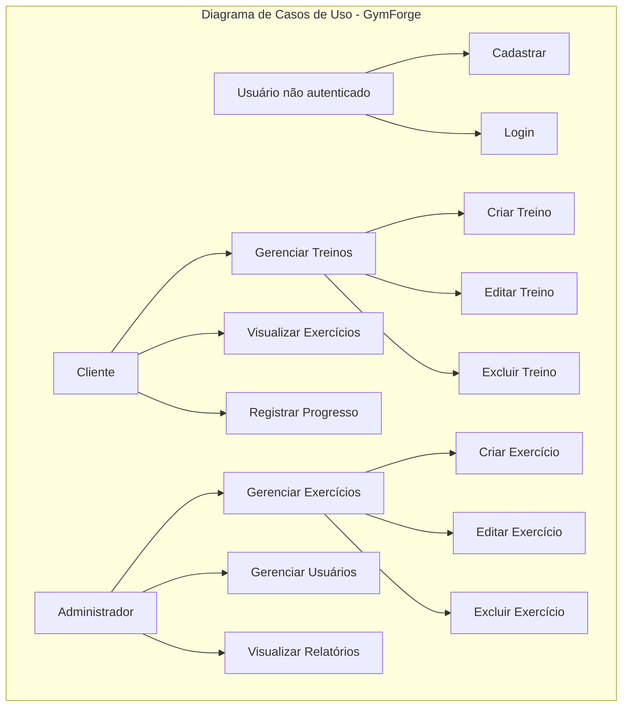
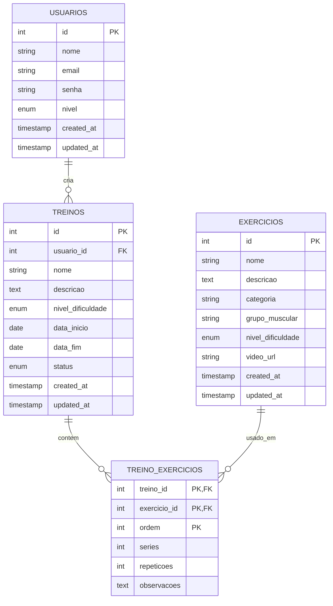

# Diagramas do Sistema GymForge

## Diagrama de Casos de Uso

```mermaid
graph TD
    subgraph "Diagrama de Casos de Uso - GymForge"
        A[Usuário não autenticado] --> B[Cadastrar]
        A --> C[Login]
        
        D[Cliente] --> E[Gerenciar Treinos]
        D --> F[Visualizar Exercícios]
        D --> G[Registrar Progresso]
        
        H[Administrador] --> I[Gerenciar Exercícios]
        H --> J[Gerenciar Usuários]
        H --> K[Visualizar Relatórios]
        
        E --> L[Criar Treino]
        E --> M[Editar Treino]
        E --> N[Excluir Treino]
        
        I --> O[Criar Exercício]
        I --> P[Editar Exercício]
        I --> Q[Excluir Exercício]
    end
```

## Diagrama Entidade-Relacionamento (DER)

```mermaid
erDiagram
    USUARIOS ||--o{ TREINOS : "cria"
    TREINOS ||--o{ TREINO_EXERCICIOS : "contem"
    EXERCICIOS ||--o{ TREINO_EXERCICIOS : "usado_em"
    
    USUARIOS {
        int id PK
        string nome
        string email
        string senha
        enum nivel
        timestamp created_at
        timestamp updated_at
    }
    
    EXERCICIOS {
        int id PK
        string nome
        text descricao
        string categoria
        string grupo_muscular
        enum nivel_dificuldade
        string video_url
        timestamp created_at
        timestamp updated_at
    }
    
    TREINOS {
        int id PK
        int usuario_id FK
        string nome
        text descricao
        enum nivel_dificuldade
        date data_inicio
        date data_fim
        enum status
        timestamp created_at
        timestamp updated_at
    }
    
    TREINO_EXERCICIOS {
        int treino_id PK,FK
        int exercicio_id PK,FK
        int ordem PK
        int series
        int repeticoes
        text observacoes
    }
``` 