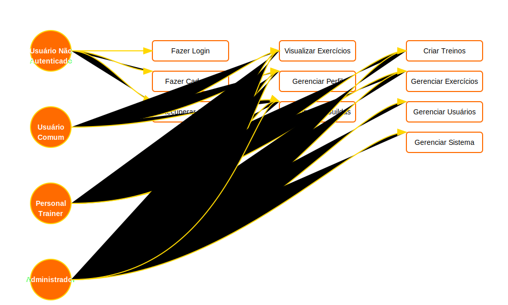
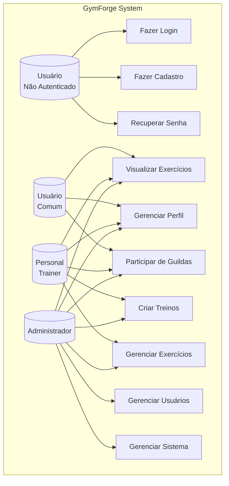
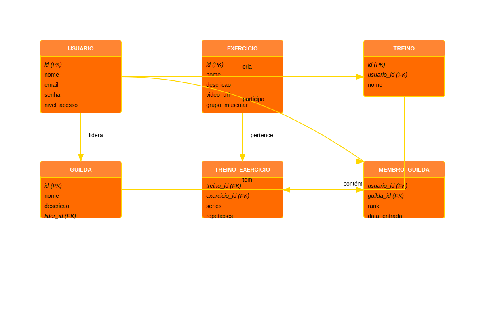
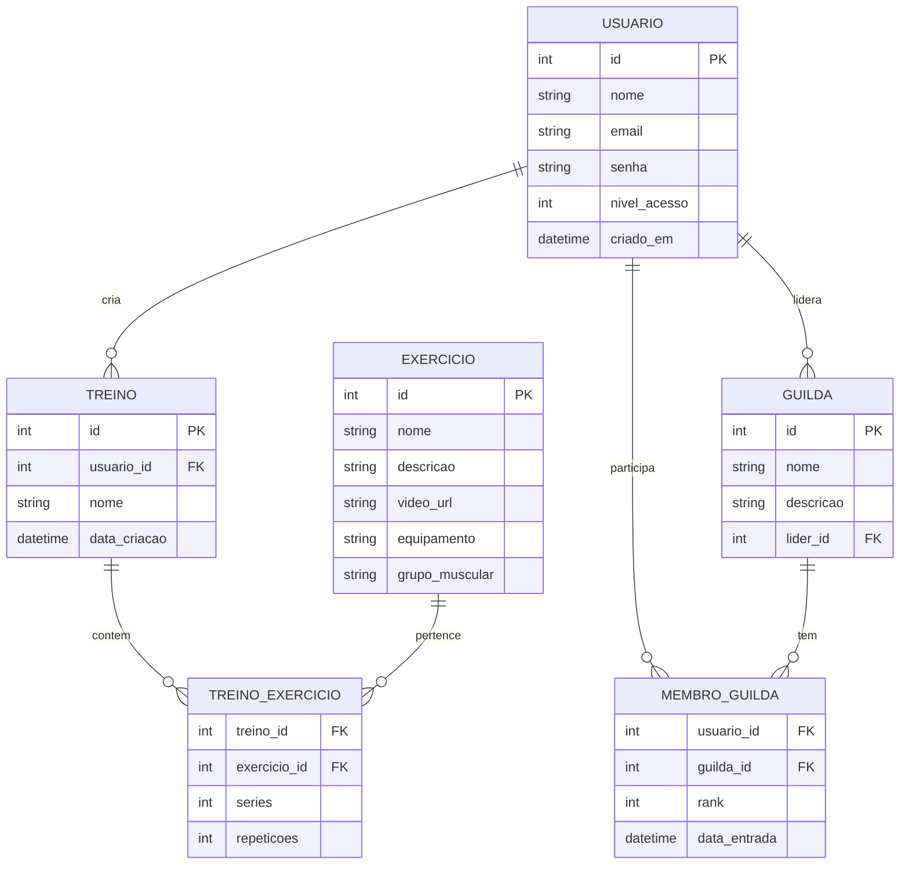

# Diagramas do Sistema GymForge

Este documento contém os diagramas principais do sistema GymForge, incluindo o Diagrama de Caso de Uso e o Diagrama Entidade-Relacionamento (ER).

## Download dos Diagramas

Para baixar os diagramas em formato SVG para uso em documentação:

1. **Direto do GitHub:**
   - [Diagrama de Caso de Uso (SVG)](https://raw.githubusercontent.com/SEU_USUARIO/GymForge-Academic/main/docs/images/use_case.svg)
   - [Diagrama ER (SVG)](https://raw.githubusercontent.com/SEU_USUARIO/GymForge-Academic/main/docs/images/er_diagram.svg)

2. **Localmente:**
   Os arquivos estão disponíveis em:
   - `docs/images/use_case.svg`
   - `docs/images/er_diagram.svg`

   Para baixar localmente, você pode:
   ```bash
   # No Windows (PowerShell)
   Copy-Item docs/images/use_case.svg C:\caminho\para\destino
   Copy-Item docs/images/er_diagram.svg C:\caminho\para\destino

   # No Linux/Mac
   cp docs/images/use_case.svg /caminho/para/destino
   cp docs/images/er_diagram.svg /caminho/para/destino
   ```

## Diagrama de Caso de Uso

O diagrama abaixo representa os principais casos de uso do sistema e suas relações com os diferentes tipos de usuários.

### Versão SVG (para documentação)


### Versão Mermaid (para visualização no GitHub)


## Diagrama Entidade-Relacionamento (ER)

O diagrama abaixo representa a estrutura do banco de dados do sistema, mostrando as principais entidades e seus relacionamentos.

### Versão SVG (para documentação)


### Versão Mermaid (para visualização no GitHub)


## Observações

1. O diagrama de caso de uso mostra a hierarquia de permissões no sistema, onde:
   - Usuários não autenticados podem apenas fazer login, cadastro ou recuperar senha
   - Usuários comuns podem visualizar exercícios, gerenciar seu perfil e participar de guildas
   - Personal trainers têm acesso adicional para criar treinos e gerenciar exercícios
   - Administradores têm acesso completo ao sistema

2. O diagrama ER mostra as principais entidades do sistema:
   - USUARIO: armazena informações dos usuários
   - EXERCICIO: catálogo de exercícios disponíveis
   - TREINO: treinos criados pelos usuários
   - TREINO_EXERCICIO: relação entre treinos e exercícios
   - GUILDA: grupos de usuários
   - MEMBRO_GUILDA: relação entre usuários e guildas

## Documentação dos Endpoints da API

### Autenticação

- `POST /api/auth/login`
  - Login do usuário
  - Parâmetros: email, senha
  - Retorno: token JWT, dados do usuário

- `POST /api/auth/registro`
  - Registro de novo usuário
  - Parâmetros: nome, email, senha
  - Retorno: token JWT, dados do usuário

- `POST /api/auth/recuperar-senha`
  - Solicita recuperação de senha
  - Parâmetros: email
  - Retorno: mensagem de sucesso

### Usuários

- `GET /api/usuarios`
  - Lista todos os usuários (requer admin)
  - Parâmetros: page, limit, search
  - Retorno: lista paginada de usuários

- `GET /api/usuarios/{id}`
  - Obtém detalhes de um usuário
  - Parâmetros: id
  - Retorno: dados do usuário

- `PUT /api/usuarios/{id}`
  - Atualiza dados do usuário
  - Parâmetros: nome, email, foto_perfil
  - Retorno: dados atualizados

- `DELETE /api/usuarios/{id}`
  - Remove um usuário (requer admin)
  - Parâmetros: id
  - Retorno: mensagem de sucesso

### Exercícios

- `GET /api/exercicios`
  - Lista todos os exercícios
  - Parâmetros: page, limit, grupo_muscular, nivel
  - Retorno: lista paginada de exercícios

- `GET /api/exercicios/{id}`
  - Obtém detalhes de um exercício
  - Parâmetros: id
  - Retorno: dados do exercício

- `POST /api/exercicios`
  - Cria novo exercício (requer admin)
  - Parâmetros: nome, descricao, grupo_muscular, nivel, video_url, imagem
  - Retorno: dados do exercício criado

- `PUT /api/exercicios/{id}`
  - Atualiza um exercício (requer admin)
  - Parâmetros: nome, descricao, grupo_muscular, nivel, video_url, imagem
  - Retorno: dados atualizados

- `DELETE /api/exercicios/{id}`
  - Remove um exercício (requer admin)
  - Parâmetros: id
  - Retorno: mensagem de sucesso

### Treinos

- `GET /api/treinos`
  - Lista treinos do usuário
  - Parâmetros: page, limit, status
  - Retorno: lista paginada de treinos

- `GET /api/treinos/{id}`
  - Obtém detalhes de um treino
  - Parâmetros: id
  - Retorno: dados do treino com exercícios

- `POST /api/treinos`
  - Cria novo treino
  - Parâmetros: nome, descricao, exercicios[]
  - Retorno: dados do treino criado

- `PUT /api/treinos/{id}`
  - Atualiza um treino
  - Parâmetros: nome, descricao, exercicios[]
  - Retorno: dados atualizados

- `DELETE /api/treinos/{id}`
  - Remove um treino
  - Parâmetros: id
  - Retorno: mensagem de sucesso

### Progresso

- `GET /api/progresso`
  - Lista registros de progresso
  - Parâmetros: page, limit, treino_id, data_inicio, data_fim
  - Retorno: lista paginada de registros

- `POST /api/progresso`
  - Registra progresso de treino
  - Parâmetros: treino_id, exercicio_id, peso, series, repeticoes
  - Retorno: dados do registro

- `GET /api/progresso/resumo`
  - Obtém resumo de progresso
  - Parâmetros: periodo
  - Retorno: estatísticas e gráficos 