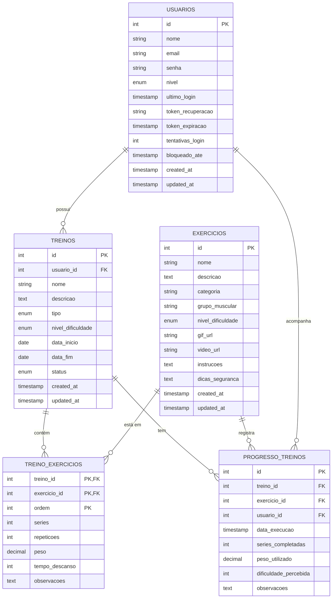

# Relatório Final - GymForge

## 1. IDENTIFICAÇÃO DO ESTUDANTE E DO SISTEMA

**Estudante:** Wesley Guilherme Lourenço

**Número de Matrícula:** 20241TBOR10010045

**Título do Sistema:** GymForge - Sistema de Gerenciamento de Academia

**Tema do Sistema:** Sistema para gerenciamento de academia e acompanhamento de treinos com gamificação.

**Logotipo do Sistema:** [Inserir logotipo]

### Justificativa e objetivos

O GymForge é uma plataforma web moderna desenvolvida para atender à crescente demanda por sistemas de gerenciamento de academias que ofereçam não apenas funcionalidades básicas de controle, mas também elementos de gamificação para aumentar o engajamento dos usuários.

Os principais objetivos do sistema são:
- Facilitar o gerenciamento de treinos e exercícios
- Promover o engajamento através de gamificação
- Fornecer acompanhamento detalhado do progresso
- Oferecer uma interface moderna e responsiva
- Garantir a segurança e privacidade dos dados

### Descrição geral das funcionalidades

#### INSERTS:
- Cadastro de usuários
- Criação de exercícios
- Criação de treinos
- Registro de progresso
- Criação de personagens (gamificação)

#### READS:
- Listagem de exercícios
- Visualização de treinos
- Consulta de progresso
- Visualização de perfil
- Histórico de atividades

#### UPDATES:
- Atualização de dados do usuário
- Edição de exercícios
- Modificação de treinos
- Atualização de progresso
- Evolução do personagem

#### DELETES:
- Remoção de exercícios
- Exclusão de treinos
- Cancelamento de conta
- Remoção de registros de progresso

#### NÍVEIS DE USUÁRIO:
1. **Visitante**
   - Visualizar exercícios
   - Registrar-se no sistema
2. **Cliente**
   - Gerenciar perfil
   - Criar e gerenciar treinos
   - Registrar progresso
   - Participar do sistema de gamificação
3. **Administrador**
   - Gerenciar usuários
   - Gerenciar exercícios
   - Definir níveis de acesso
   - Acessar relatórios do sistema

**Link do Github:** https://github.com/Wesley-GL23/GymForge-Academic.git

## 2. PRINCIPAIS TELAS DO SISTEMA

### Tela 1: Página Inicial
- Hero section com chamada para ação
- Seção de benefícios
- Depoimentos de usuários
- Planos e preços
- Call-to-action para registro

### Tela 2: Painel do Usuário
- Visão geral dos treinos
- Progresso e estatísticas
- Últimas atividades
- Notificações
- Status do personagem

### Tela 3: Biblioteca de Exercícios
- Catálogo de exercícios
- Filtros por categoria
- Vídeos demonstrativos
- Instruções detalhadas
- Dicas de segurança

### Tela 4: Área de Treinos
- Criação de treinos
- Templates pré-definidos
- Histórico de treinos
- Métricas de progresso
- Sistema de conquistas

### Tela 5: Perfil e Configurações
- Dados do usuário
- Preferências do sistema
- Histórico de atividades
- Conquistas e níveis
- Configurações de privacidade

## 3. MODELAGEM DO SISTEMA

### Diagrama Geral de Casos de Uso

```mermaid
graph TB
    subgraph Atores
        Visitante[Visitante]
        Cliente[Cliente]
        Admin[Administrador]
    end

    subgraph Autenticação
        Login[Login]
        Registro[Registro]
        RecuperarSenha[Recuperar Senha]
        AlterarSenha[Alterar Senha]
    end

    subgraph Gerenciamento de Usuários
        GerenciarPerfil[Gerenciar Perfil]
        GerenciarUsuarios[Gerenciar Usuários]
        DefinirNiveis[Definir Níveis de Acesso]
    end

    subgraph Exercícios
        VisualizarExercicios[Visualizar Exercícios]
        GerenciarExercicios[Gerenciar Exercícios]
        FiltrarExercicios[Filtrar Exercícios]
        BuscarExercicios[Buscar Exercícios]
    end

    subgraph Treinos
        CriarTreino[Criar Treino]
        EditarTreino[Editar Treino]
        ExcluirTreino[Excluir Treino]
        VisualizarTreino[Visualizar Treino]
        AcompanharProgresso[Acompanhar Progresso]
    end

    %% Relacionamentos Visitante
    Visitante --> Login
    Visitante --> Registro
    Visitante --> RecuperarSenha
    Visitante --> VisualizarExercicios
    Visitante --> FiltrarExercicios
    Visitante --> BuscarExercicios

    %% Relacionamentos Cliente
    Cliente --> GerenciarPerfil
    Cliente --> AlterarSenha
    Cliente --> CriarTreino
    Cliente --> EditarTreino
    Cliente --> ExcluirTreino
    Cliente --> VisualizarTreino
    Cliente --> AcompanharProgresso
    Cliente --> VisualizarExercicios
    Cliente --> FiltrarExercicios
    Cliente --> BuscarExercicios

    %% Relacionamentos Admin
    Admin --> GerenciarUsuarios
    Admin --> DefinirNiveis
    Admin --> GerenciarExercicios
    Admin --> GerenciarPerfil
    Admin --> AlterarSenha
    Admin --> CriarTreino
    Admin --> EditarTreino
    Admin --> ExcluirTreino
    Admin --> VisualizarTreino
    Admin --> AcompanharProgresso
```

### Diagrama Entidade-Relacionamento

## 4. RELATO DO USO DA INTELIGÊNCIA ARTIFICIAL

Durante o desenvolvimento do GymForge, a Inteligência Artificial foi utilizada de forma estratégica para:

1. **Geração de Código**
   - Criação de estruturas básicas de arquivos
   - Implementação de funções de validação
   - Desenvolvimento de queries SQL otimizadas

2. **Documentação**
   - Geração de diagramas UML
   - Documentação de API
   - Criação de guias de usuário

3. **Design e UX**
   - Sugestões de paleta de cores
   - Melhorias na experiência do usuário
   - Otimização de fluxos de navegação

4. **Segurança**
   - Implementação de práticas de segurança
   - Validação de entrada de dados
   - Proteção contra vulnerabilidades comuns

5. **Otimização**
   - Melhoria de performance
   - Otimização de consultas
   - Refatoração de código

A IA foi uma ferramenta valiosa que acelerou o desenvolvimento e melhorou a qualidade do código, sempre sob supervisão humana para garantir a qualidade e segurança do sistema. 