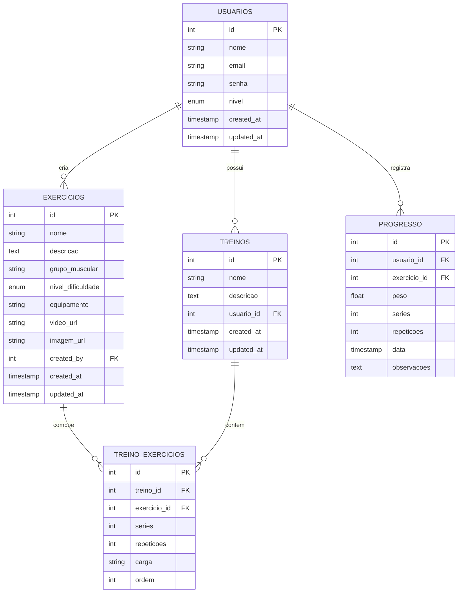

# Diagrama Entidade-Relacionamento - GymForge

Este diagrama representa a estrutura do banco de dados do sistema GymForge, mostrando as tabelas, seus relacionamentos e atributos.

## Entidades

### USUARIOS
- Armazena informações dos usuários do sistema
- **Atributos:**
  - `id` (PK): Identificador único
  - `nome`: Nome completo do usuário
  - `email`: Email único do usuário
  - `senha`: Senha criptografada
  - `nivel`: Nível de acesso (visitante, cliente, administrador)
  - `created_at`: Data de criação
  - `updated_at`: Data de última atualização

### EXERCICIOS
- Catálogo de exercícios disponíveis
- **Atributos:**
  - `id` (PK): Identificador único
  - `nome`: Nome do exercício
  - `descricao`: Descrição detalhada
  - `grupo_muscular`: Grupo muscular trabalhado
  - `nivel_dificuldade`: Nível de dificuldade
  - `equipamento`: Equipamento necessário
  - `video_url`: Link para vídeo demonstrativo
  - `imagem_url`: Link para imagem ilustrativa
  - `created_by` (FK): Usuário que criou
  - `created_at`: Data de criação
  - `updated_at`: Data de última atualização

### TREINOS
- Treinos personalizados dos usuários
- **Atributos:**
  - `id` (PK): Identificador único
  - `nome`: Nome do treino
  - `descricao`: Descrição do treino
  - `usuario_id` (FK): Usuário dono do treino
  - `created_at`: Data de criação
  - `updated_at`: Data de última atualização

### TREINO_EXERCICIOS
- Relacionamento entre treinos e exercícios
- **Atributos:**
  - `id` (PK): Identificador único
  - `treino_id` (FK): Treino relacionado
  - `exercicio_id` (FK): Exercício relacionado
  - `series`: Número de séries
  - `repeticoes`: Número de repetições
  - `carga`: Peso/carga utilizada
  - `ordem`: Ordem do exercício no treino

### PROGRESSO
- Registro do progresso dos usuários
- **Atributos:**
  - `id` (PK): Identificador único
  - `usuario_id` (FK): Usuário relacionado
  - `exercicio_id` (FK): Exercício relacionado
  - `peso`: Peso utilizado
  - `series`: Séries realizadas
  - `repeticoes`: Repetições realizadas
  - `data`: Data do registro
  - `observacoes`: Observações adicionais

## Relacionamentos

1. **USUARIOS -> EXERCICIOS**
   - Um usuário pode criar vários exercícios
   - Um exercício é criado por um usuário

2. **USUARIOS -> TREINOS**
   - Um usuário pode ter vários treinos
   - Um treino pertence a um usuário

3. **TREINOS -> TREINO_EXERCICIOS**
   - Um treino pode ter vários exercícios
   - Um exercício pode estar em vários treinos
   - TREINO_EXERCICIOS é uma tabela de junção

4. **USUARIOS -> PROGRESSO**
   - Um usuário pode ter vários registros de progresso
   - Um registro de progresso pertence a um usuário

