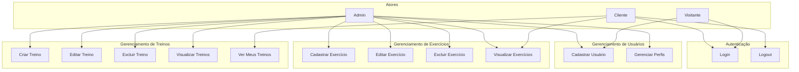

```mermaid
graph TD
    subgraph Atores
        A[Admin]
        C[Cliente]
        V[Visitante]
    end

    subgraph "Gerenciamento de Usuários"
        GU1[Cadastrar Usuário]
        GU2[Gerenciar Perfis]
    end

    subgraph "Gerenciamento de Exercícios"
        GE1[Cadastrar Exercício]
        GE2[Editar Exercício]
        GE3[Excluir Exercício]
        GE4[Visualizar Exercícios]
    end

    subgraph "Gerenciamento de Treinos"
        GT1[Criar Treino]
        GT2[Editar Treino]
        GT3[Excluir Treino]
        GT4[Visualizar Treinos]
        GT5[Ver Meus Treinos]
    end

    subgraph "Autenticação"
        AU1[Login]
        AU2[Logout]
    end

    A --> GU1
    A --> GU2
    A --> GE1
    A --> GE2
    A --> GE3
    A --> GE4
    A --> GT1
    A --> GT2
    A --> GT3
    A --> GT4
    
    C --> GT5
    C --> GE4
    C --> AU1
    C --> AU2
    
    V --> GU1
    V --> AU1
``` 