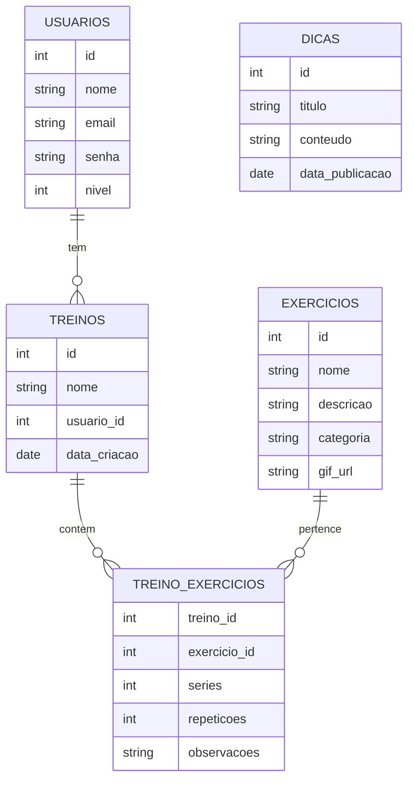

```mermaid
erDiagram
    USUARIOS ||--o{ TREINOS : tem
    USUARIOS {
        int id
        string nome
        string email
        string senha
        int nivel
    }
    TREINOS ||--o{ TREINO_EXERCICIOS : contem
    TREINOS {
        int id
        string nome
        int usuario_id
        date data_criacao
    }
    EXERCICIOS ||--o{ TREINO_EXERCICIOS : pertence
    EXERCICIOS {
        int id
        string nome
        string descricao
        string categoria
        string gif_url
    }
    TREINO_EXERCICIOS {
        int treino_id
        int exercicio_id
        int series
        int repeticoes
        string observacoes
    }
    DICAS {
        int id
        string titulo
        string conteudo
        date data_publicacao
    }
``` 