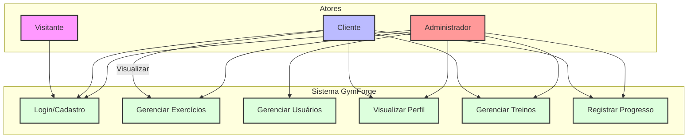

# Diagrama de Casos de Uso - GymForge

Este diagrama representa as principais funcionalidades do sistema GymForge e como os diferentes tipos de usuários (atores) interagem com elas.

## Atores

1. **Visitante**
   - Pode se cadastrar no sistema
   - Pode fazer login

2. **Cliente**
   - Herda todas as permissões do Visitante
   - Pode visualizar exercícios
   - Pode gerenciar seus treinos
   - Pode registrar seu progresso
   - Pode visualizar seu perfil

3. **Administrador**
   - Herda todas as permissões do Cliente
   - Pode gerenciar exercícios (CRUD completo)
   - Pode gerenciar usuários (CRUD completo)

## Casos de Uso

### Login/Cadastro
- Permite que usuários se autentiquem no sistema
- Permite que visitantes criem uma nova conta
- Validação de credenciais
- Controle de sessão

### Gerenciar Exercícios
- Listar todos os exercícios
- Criar novos exercícios (admin)
- Editar exercícios existentes (admin)
- Excluir exercícios (admin)
- Visualizar detalhes dos exercícios

### Gerenciar Usuários (Admin)
- Listar todos os usuários
- Criar novos usuários
- Editar usuários existentes
- Excluir usuários
- Gerenciar níveis de acesso

### Gerenciar Treinos
- Criar treinos personalizados
- Adicionar exercícios aos treinos
- Definir séries, repetições e cargas
- Editar treinos existentes
- Excluir treinos

### Registrar Progresso
- Registrar peso utilizado
- Registrar séries e repetições realizadas
- Adicionar observações
- Visualizar histórico de progresso

### Visualizar Perfil
- Ver informações pessoais
- Visualizar histórico de treinos
- Acompanhar progresso

